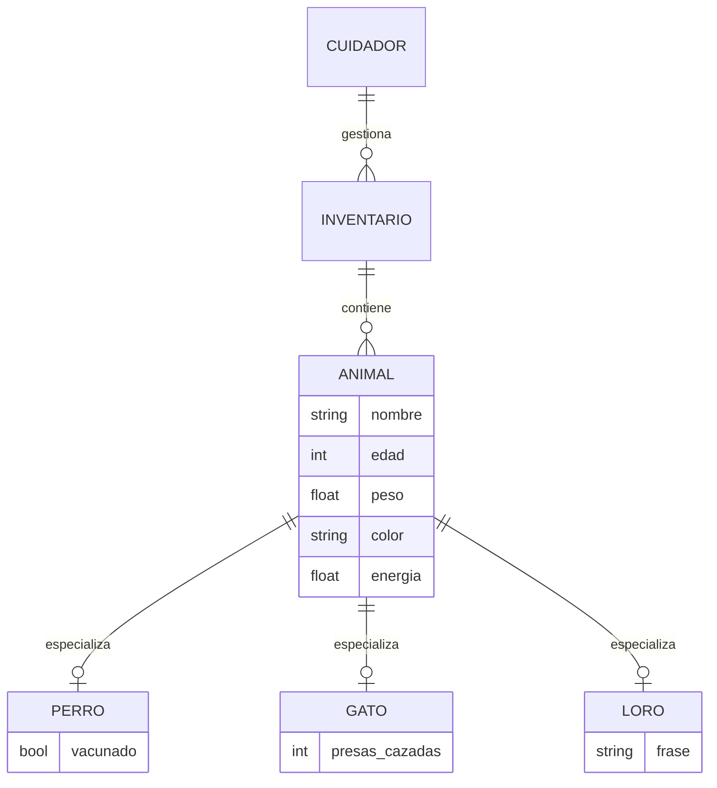
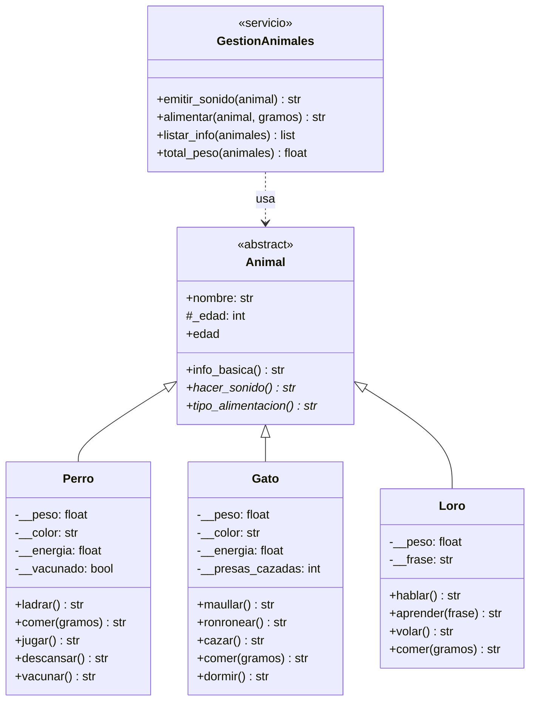
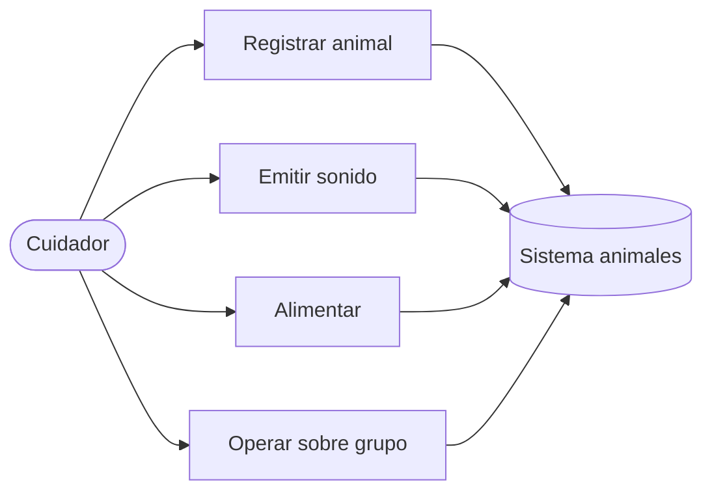
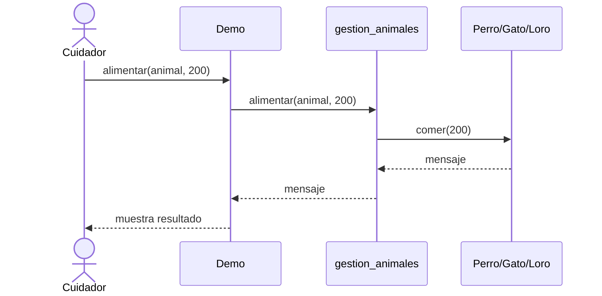

# Análisis del dominio: entidades, E/R extendido y UML

Guía práctica para pasar de un **planteamiento inicial** a entidades,
relaciones y diagramas. Corresponde a la **Fase 1** de la
[Plantilla maestra de diseño](PLANTILLA_DISENO.md).

Proyecto de ejemplo: [poo_animales](https://github.com/gracobjo/poo_animales).

---

## Del planteamiento a las entidades

Antes de carpetas y código: **descubrir** qué existe en el problema y cómo
se relaciona. Esta fase une análisis de requisitos, un **modelo E/R
extendido** (conceptual) y **diagramas UML**.

### 1.1 Planteamiento inicial (historia del problema)

Escribe en 5–10 líneas *qué hace el usuario* y *qué debe recordar el
sistema*. Ejemplo (Animales):

> Un cuidador registra perros y gatos con nombre, edad, peso, color y
> energía. Cada animal emite un sonido distinto, come (sube peso y
> recupera energía) y tiene acciones propias (jugar/vacunar; cazar/dormir).
> El cuidador también opera sobre un grupo: listar fichas, filtrar por
> edad y sumar pesos, sin preguntar la especie en cada llamada.

Plantilla en blanco:

```text
Actor(es): _______________________________________________
Objetivo: ________________________________________________
Datos que el sistema guarda: _____________________________
Acciones que el usuario dispara: _________________________
Restricciones (“nunca debe…”): ___________________________
```

### 1.2 Extracción de candidatos (sustantivos y verbos)

1. Subraya **sustantivos** → candidatos a entidad o atributo.
2. Subraya **verbos** → candidatos a método o caso de uso.
3. Clasifica cada sustantivo:

| Candidato | ¿Entidad? | ¿Atributo de…? | ¿Descartar? | Motivo |
| --- | --- | --- | --- | --- |
| | Sí / No | | | |

**Heurísticas:**

| Señal | Suele ser |
| --- | --- |
| Tiene identidad + ciclo de vida + varias acciones | **Entidad / clase** |
| Solo califica a otro (color, edad) | **Atributo** |
| Es un rol del usuario (cuidador) | Actor (no siempre clase del dominio) |
| Es un proceso o un informe | Caso de uso / servicio, no entidad |
| Varias “clases de lo mismo” (perro, gato) | **Especialización** (herencia / E/R extendido) |

Ejemplo Animales (resumen):

| Candidato | Decisión |
| --- | --- |
| Animal | Entidad abstracta (superclase) |
| Perro, Gato, Loro | Entidades concretas (especializaciones) |
| Nombre, peso, energía | Atributos |
| Cuidador | Actor externo (no clase v1) |
| Grupo / inventario | Colección / servicio (agregación) |
| Sonido, comida | Comportamientos (métodos) |

### 1.3 Modelo E/R extendido (conceptual)

El modelo entidad-relación **extendido** añade a las entidades y
atributos clásicos: **especialización/generalización**, agregación y
restricciones. Sirve para pensar el dominio *antes* de dibujar clases UML.

#### Notación rápida (texto)

| Concepto E/R | Significado | En POO suele acabar como |
| --- | --- | --- |
| Entidad | Cosa del dominio con identidad | Clase |
| Atributo | Propiedad | Campo / `@property` |
| Relación | Vínculo entre entidades | Asociación, colección |
| Cardinalidad 1:N, N:M | Cuántos participan | Lista, dict, tabla puente |
| **Generalización** | “Es un tipo de…” | Herencia (`Animal` ← `Perro`) |
| **Especialización total/parcial** | ¿Toda instancia es de un subtipo? | ABC no instanciable = total |
| Agregación / composición | “Tiene / está formado por” | Atributo que referencia objetos |

#### Diagrama E/R extendido — ejemplo Animales



Lectura:

- `PERRO` / `GATO` / `LORO` **especializan** `ANIMAL` (isa).
- La especialización es **total** a efectos de diseño: no existen animales
  “genéricos” instanciables → en código, `Animal` es `ABC`.
- `INVENTARIO` **agrega** muchos animales (1:N). En v1 puede ser una lista
  en memoria o el store de la API; no hace falta persistirlo aún.

#### Plantilla E/R (rellena la tuya)

```text
Entidades fuertes: _______________________________________
Especializaciones (A es un B): ____________________________
Relaciones y cardinalidades:
  - ________ (1) —— (N) ________
  - ________ (N) —— (M) ________
Atributos clave / únicos: _________________________________
Restricciones: ____________________________________________
```

### 1.4 Paso a UML

El E/R responde *qué datos y vínculos existen*. El **UML de clases**
añade *comportamiento* (métodos) y visibilidad (+ público, − privado).

| Del E/R… | Al diagrama de clases UML… |
| --- | --- |
| Entidad | Clase |
| Atributo | Atributo (con tipo) |
| Generalización | Flecha de herencia (△ vacío) |
| Relación 1:N | Asociación con multiplicidad `1` y `0..*` |
| Restricción de dominio | Nota, invariante o regla en método/setter |

#### Diagrama de clases UML — ejemplo Animales



#### Otros diagramas UML útiles (elige según el proyecto)

| Diagrama | Cuándo dibujarlo | Pregunta que responde |
| --- | --- | --- |
| **Casos de uso** | Al inicio, con el actor | ¿Qué puede pedir el usuario? |
| **Clases** | Tras el E/R | ¿Qué clases, atributos y métodos? |
| **Secuencia** | Un flujo crítico (p. ej. alimentar) | ¿Quién llama a quién, en qué orden? |
| **Estados** | Si hay ciclos de vida (pedido, vacunación) | ¿Qué estados y transiciones? |

Ejemplo de **casos de uso** (Animales, fragmento):



Ejemplo de **secuencia** (alimentar vía servicio):



### 1.5 De los diagramas al código (mapa corto)

| Decisión de análisis | Decisión de implementación |
| --- | --- |
| Especialización total | `ABC` + `@abstractmethod` |
| Atributo sensible | `__` + `@property` con validación |
| Relación 1:N “inventario contiene animales” | `list[Animal]` / store de la API |
| Operación sobre “cualquier animal” | Función en `servicios/` tipada con la base |
| Restricción “peso > 0” | `validar_positivo` en el setter |

### 1.6 Checklist de esta fase

- [ ] Tengo un planteamiento escrito (historia + restricciones).
- [ ] Lista de sustantivos/verbos clasificada (entidad / atributo / descartar).
- [ ] Boceto E/R extendido (aunque sea en papel o Mermaid).
- [ ] Diagrama de clases UML con métodos, no solo datos.
- [ ] Sé qué es herencia y qué es asociación/agregación.
- [ ] (Opcional) Un diagrama de secuencia del flujo más importante.

> **No hace falta** una herramienta cara: Mermaid en Markdown (GitHub lo
> renderiza), draw.io, o ASCII bastan para Nivel 2.

---
