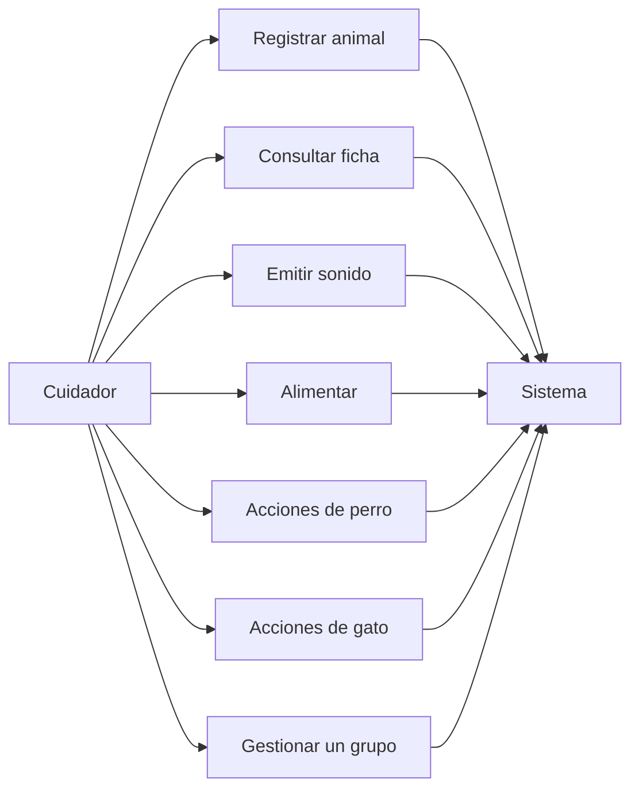

# Casos de uso

Este documento describe lo que un cuidador puede hacer con la biblioteca de animales: registrar perros y gatos, consultarlos, alimentarlos y aplicar el comportamiento propio de cada especie. No hay interfaz gráfica. El cuidador invoca las clases y las funciones desde Python, como hace `ejemplos/demo_completa.py`.

## Actores

| Actor | Papel |
| --- | --- |
| Cuidador | Quien crea los animales y les pide acciones. Puede ser un script, la demo o las pruebas. |
| Sistema | El código de `src/`. Valida los datos, actualiza el estado y devuelve un mensaje o lanza un error. |

## Diagrama general

## Reglas que se aplican en todos los casos

- El nombre es un texto no vacío. Se recortan los espacios de los extremos.
- La edad es un entero entre 0 y 30, inclusive.
- El peso es un número mayor que cero, en kilogramos.
- El color es un texto no vacío. También se recortan los espacios.
- La energía es un número entre 0 y 100.
- `True` y `False` no cuentan como números, aunque en Python `bool` sea una subclase de `int`.
- Si una acción recibe datos inválidos, el sistema lanza `ValueError` y no cambia el estado del animal.
- `Animal` no se puede construir. El intento lanza `TypeError`.

## Catálogo

| ID | Nombre | Resultado principal |
| --- | --- | --- |
| CU-01 | Registrar un perro | Existe un `Perro` sin vacunar |
| CU-02 | Registrar un gato | Existe un `Gato` con cero presas |
| CU-03 | Consultar la ficha | Texto con nombre, especie y edad |
| CU-04 | Emitir el sonido | Ladrido o maullido según la clase real |
| CU-05 | Alimentar | Sube el peso y recupera energía |
| CU-06 | Jugar con un perro | Gasta 20 de energía |
| CU-07 | Dejar descansar a un perro | Recupera 25 de energía, máximo 100 |
| CU-08 | Vacunar a un perro | Queda vacunado una sola vez |
| CU-09 | Hacer ronronear a un gato | Emite el ronroneo si tiene energía |
| CU-10 | Hacer cazar a un gato | Gasta 25 de energía y suma una presa |
| CU-11 | Dejar dormir a un gato | Recupera 40 de energía, máximo 100 |
| CU-12 | Actualizar datos encapsulados | El setter acepta o rechaza el valor |
| CU-13 | Listar un grupo | Una línea de ficha por animal |
| CU-14 | Filtrar por edad | Animales con edad mayor o igual al mínimo |
| CU-15 | Calcular el peso total | Suma de los kilogramos del grupo |
| CU-16 | Impedir un animal genérico | `TypeError` al instanciar `Animal` |

---

## CU-01. Registrar un perro

**Actor:** cuidador.

**Descripción:** crea un perro con nombre, edad, peso, color y, si se indica, energía inicial.

**Precondiciones:** ninguna. El perro todavía no existe.

**Flujo principal:**

1. El cuidador llama a `Perro(nombre, edad, peso, color)` o añade `energia`.
2. El sistema valida el nombre y la edad en `Animal`.
3. El sistema valida peso, color y energía mediante las propiedades.
4. El sistema deja `vacunado` en `False`.
5. Si no se pasó energía, queda en 100.

**Flujos alternativos:**

- Nombre vacío, edad fuera de rango, peso no positivo, color vacío o energía fuera de 0–100: el sistema lanza `ValueError` y no devuelve un perro utilizable.

**Postcondición:** hay una instancia de `Perro` y de `Animal`, sin vacunar.

---

## CU-02. Registrar un gato

**Actor:** cuidador.

**Descripción:** crea un gato con los mismos datos básicos que un perro.

**Precondiciones:** ninguna.

**Flujo principal:**

1. El cuidador llama a `Gato(nombre, edad, peso, color)` o añade `energia`.
2. El sistema aplica las mismas validaciones que en el perro.
3. El sistema deja `presas_cazadas` en 0.
4. Si no se pasó energía, queda en 100.

**Flujos alternativos:** los mismos rechazos del CU-01.

**Postcondición:** hay una instancia de `Gato` y de `Animal`, con cero presas.

---

## CU-03. Consultar la ficha

**Actor:** cuidador.

**Descripción:** obtiene una descripción legible de un animal ya creado.

**Precondiciones:** el animal existe.

**Flujo principal:**

1. El cuidador llama a `info_basica()` o convierte el objeto a texto con `str()`.
2. `info_basica()` responde con el nombre, la clase concreta y la edad. Ejemplo: `Rex es un Perro de 5 años.`
3. `str()` añade peso, color, energía y el dato propio de la especie: vacunación en el perro, presas en el gato.

**Postcondición:** el estado del animal no cambia.

---

## CU-04. Emitir el sonido

**Actor:** cuidador.

**Descripción:** pide un sonido sin saber si el animal es perro o gato.

**Precondiciones:** el animal existe y es una subclase concreta de `Animal`.

**Flujo principal:**

1. El cuidador llama a `emitir_sonido(animal)` o a `animal.hacer_sonido()`.
2. Si es un perro, el sistema responde `Rex dice: ¡Guau!`.
3. Si es un gato, el sistema responde `Misi dice: ¡Miau!`.
4. El mensaje incluye el nombre real del animal.

**Flujos alternativos:**

- El objeto no tiene `hacer_sonido`: `emitir_sonido` lanza `ValueError`.

**Postcondición:** el estado del animal no cambia. La misma función sirve para las dos especies.

---

## CU-05. Alimentar

**Actor:** cuidador.

**Descripción:** da una ración en gramos. El peso sube y la energía se recupera, con el tope de cada especie.

**Precondiciones:** el animal existe e implementa `comer(gramos)`.

**Flujo principal:**

1. El cuidador llama a `alimentar(animal, gramos)` o a `animal.comer(gramos)`.
2. El sistema comprueba que los gramos sean un número mayor que cero.
3. Suma `gramos / 1000` kilogramos al peso.
4. Un perro recupera 15 de energía. Un gato recupera 10.
5. Si la suma superaría 100, la energía queda en 100.
6. El sistema devuelve un mensaje con el nombre y el peso actual, con dos decimales.

**Flujos alternativos:**

- Gramos cero, negativos o no numéricos: `ValueError`. El peso y la energía se quedan como estaban.
- El objeto no tiene un método `comer`: `alimentar` lanza `ValueError`.

**Postcondición:** el animal pesa más y, si no estaba al máximo, tiene más energía.

---

## CU-06. Jugar con un perro

**Actor:** cuidador.

**Descripción:** el perro juega y gasta energía.

**Precondiciones:** el perro existe.

**Flujo principal:**

1. El cuidador llama a `perro.jugar()`.
2. El sistema comprueba que la energía sea al menos 20.
3. Resta 20 y devuelve un mensaje con la energía restante.

**Flujos alternativos:**

- Energía menor que 20: `ValueError`. La energía no cambia.

**Postcondición:** la energía es 20 puntos menor que antes.

---

## CU-07. Dejar descansar a un perro

**Actor:** cuidador.

**Descripción:** el perro recupera energía descansando.

**Precondiciones:** el perro existe.

**Flujo principal:**

1. El cuidador llama a `perro.descansar()`.
2. El sistema suma 25 a la energía.
3. Si el resultado pasaría de 100, la deja en 100.

**Postcondición:** la energía subió o se mantuvo en 100. Nunca queda por encima de 100.

---

## CU-08. Vacunar a un perro

**Actor:** cuidador.

**Descripción:** marca al perro como vacunado.

**Precondiciones:** el perro existe y `vacunado` es `False`.

**Flujo principal:**

1. El cuidador llama a `perro.vacunar()`.
2. El sistema pone la vacunación en `True`.
3. Devuelve `{nombre} ha sido vacunado.`

**Flujos alternativos:**

- El perro ya estaba vacunado: `ValueError` con el texto `{nombre} ya está vacunado.` El estado sigue en `True`.
- El cuidador intenta `perro.vacunado = False`: `AttributeError`, porque la propiedad es de solo lectura.

**Postcondición:** el perro queda vacunado y no puede vacunarse otra vez.

---

## CU-09. Hacer ronronear a un gato

**Actor:** cuidador.

**Descripción:** el gato ronronea si está lo bastante descansado.

**Precondiciones:** el gato existe.

**Flujo principal:**

1. El cuidador llama a `gato.ronronear()`.
2. El sistema comprueba que la energía sea al menos 20.
3. Devuelve `{nombre} ronronea: Prrr...`.
4. No descuenta energía.

**Flujos alternativos:**

- Energía menor que 20: `ValueError`. La energía no cambia.

**Postcondición:** el estado del gato es el mismo que antes de ronronear.

---

## CU-10. Hacer cazar a un gato

**Actor:** cuidador.

**Descripción:** el gato caza una presa.

**Precondiciones:** el gato existe.

**Flujo principal:**

1. El cuidador llama a `gato.cazar()`.
2. El sistema comprueba que la energía sea al menos 25.
3. Resta 25 de energía.
4. Suma una presa.
5. Devuelve un mensaje con el total de presas.

**Flujos alternativos:**

- Energía menor que 25: `ValueError`. No suma la presa y no cambia la energía.
- El cuidador intenta asignar `presas_cazadas`: `AttributeError`. Solo `cazar()` incrementa el contador.

**Postcondición:** hay una presa más y 25 puntos menos de energía.

---

## CU-11. Dejar dormir a un gato

**Actor:** cuidador.

**Descripción:** el gato duerme y recupera energía.

**Precondiciones:** el gato existe.

**Flujo principal:**

1. El cuidador llama a `gato.dormir()`.
2. El sistema suma 40 a la energía, con tope en 100.

**Postcondición:** la energía subió o se mantuvo en 100.

---

## CU-12. Actualizar datos encapsulados

**Actor:** cuidador.

**Descripción:** cambia peso, color, energía o edad a través de las propiedades, no tocando los atributos privados.

**Precondiciones:** el animal existe.

**Flujo principal:**

1. El cuidador asigna `animal.peso`, `animal.color`, `animal.energia` o `animal.edad`.
2. El setter valida el valor.
3. Si es válido, el sistema guarda el dato. El color se guarda sin espacios sobrantes.
4. Una lectura posterior con la propiedad devuelve el valor nuevo.

**Flujos alternativos:**

- Valor inválido: `ValueError` y el dato anterior se conserva.
- Lectura de `__peso` desde fuera de la clase: `AttributeError`. Python guarda ese dato con el nombre interno `_Perro__peso` o `_Gato__peso`.

**Postcondición:** solo quedan almacenados valores que cumplen las reglas de dominio.

---

## CU-13. Listar un grupo

**Actor:** cuidador.

**Descripción:** pide la ficha de varios animales a la vez.

**Precondiciones:** se dispone de una lista o tupla de animales. Puede estar vacía.

**Flujo principal:**

1. El cuidador llama a `listar_info(animales)`.
2. El sistema recorre la secuencia y llama a `info_basica()` en cada elemento.
3. Devuelve una lista de textos, en el mismo orden.

**Flujos alternativos:**

- Se pasa un texto u otro objeto no iterable: `ValueError`.
- Algún elemento no implementa `info_basica()`: `ValueError`.

**Postcondición:** los animales no cambian. Una lista vacía devuelve una lista vacía.

---

## CU-14. Filtrar por edad

**Actor:** cuidador.

**Descripción:** se queda con los animales que ya tienen cierta edad.

**Precondiciones:** hay una secuencia de animales y una edad mínima entera, mayor o igual que cero.

**Flujo principal:**

1. El cuidador llama a `animales_mayores_de(animales, edad_minima)`.
2. El sistema incluye a quien tenga `edad >= edad_minima`.
3. Devuelve una lista nueva. La original no se modifica.

**Flujos alternativos:**

- `edad_minima` negativa, decimal o booleana: `ValueError`.
- La secuencia no es válida: `ValueError`.

**Postcondición:** la lista resultado solo contiene animales que cumplen el filtro. Puede estar vacía.

---

## CU-15. Calcular el peso total

**Actor:** cuidador.

**Descripción:** suma los kilogramos de un grupo.

**Precondiciones:** hay una secuencia de animales con la propiedad `peso`.

**Flujo principal:**

1. El cuidador llama a `total_peso(animales)`.
2. El sistema suma `animal.peso` de cada elemento.
3. Devuelve la suma como número. Una secuencia vacía devuelve `0.0`.

**Flujos alternativos:**

- Falta la propiedad `peso`, o no es numérica: `ValueError`.
- La entrada no es una secuencia: `ValueError`.

**Postcondición:** los pesos individuales no cambian.

---

## CU-16. Impedir un animal genérico

**Actor:** cuidador.

**Descripción:** el sistema rechaza crear un `Animal` que no sea perro ni gato.

**Precondiciones:** ninguna.

**Flujo principal:**

1. El cuidador llama a `Animal(nombre, edad)`.
2. El sistema lanza `TypeError` porque `hacer_sonido` y `tipo_alimentacion` no tienen implementación.

**Postcondición:** no existe una instancia de la clase abstracta. Para tener un animal hay que usar `Perro` o `Gato` (CU-01 o CU-02).
