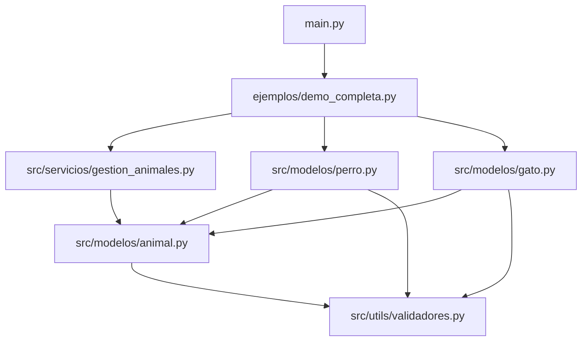
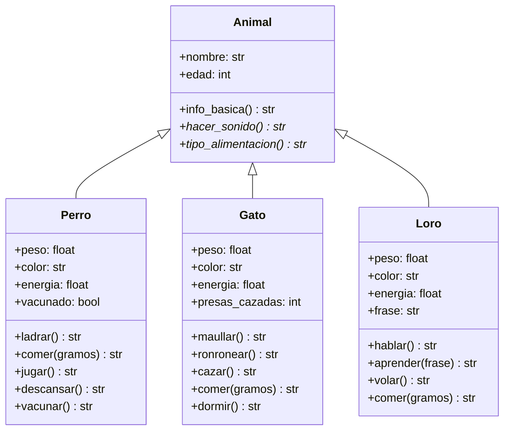

# Manual de desarrollador

Guía para entender, ejecutar y extender el proyecto. El lector que solo quiere ver la demo puede quedarse en el [README](../README.md). Los escenarios funcionales están en [Casos de uso](casos_de_uso.md). Para el proceso completo de desarrollo (análisis → pruebas), ver la [Documentación técnica y pedagógica](documentacion_tecnica_pedagogica.md). Para un curso paso a paso (incluye comparación con `dict`), ver el [Tutorial de especialización](tutorial_especializacion.md). La capa HTTP opcional con Swagger está en [API HTTP y Swagger](api_swagger.md). Para clonar el enfoque en otro dominio, usa la [Plantilla maestra de diseño](PLANTILLA_DISENO.md).

Repositorio: [https://github.com/gracobjo/poo_animales](https://github.com/gracobjo/poo_animales)

## 1. Requisitos

- Python 3.8 o superior.
- **Núcleo POO:** biblioteca estándar. No hay dependencias que instalar para `main.py` ni para los tests de modelos.
- **API opcional (Swagger):** `pip install -r requirements.txt` y luego `uvicorn src.api.app:app --reload`. Detalle en [api_swagger.md](api_swagger.md).
- Sistema operativo indiferente. Los comandos de esta guía asumen que el directorio actual es la raíz del proyecto.

Comprobar la versión:

```bash
python --version
```

## 2. Crear las carpetas por primera vez

Si el proyecto todavía no existe, este script de PowerShell crea cada archivo y, si hace falta, la carpeta que lo contiene. No hay que crear `src`, `tests` ni `ejemplos` a mano.

Ejecútalo en la carpeta padre de `animales_poo`. Por ejemplo, en `Documentos\proyectosMios` si el proyecto debe quedar en `Documentos\proyectosMios\animales_poo`. `New-Item -Force` sobre un archivo que ya existe lo deja vacío: úsalo solo para montar la estructura la primera vez.

```powershell
function Crear-Archivo($ruta) {
    $carpeta = Split-Path $ruta -Parent
    if (-not (Test-Path $carpeta)) {
        New-Item -ItemType Directory -Force -Path $carpeta | Out-Null
    }
    New-Item -ItemType File -Force -Path $ruta | Out-Null
}

# Ahora puedes crear archivos sin preocuparte por las carpetas
Crear-Archivo "animales_poo\src\modelos\animal.py"
Crear-Archivo "animales_poo\src\modelos\perro.py"
Crear-Archivo "animales_poo\src\modelos\gato.py"
Crear-Archivo "animales_poo\src\modelos\loro.py"
Crear-Archivo "animales_poo\src\servicios\gestion_animales.py"
Crear-Archivo "animales_poo\src\utils\validadores.py"
Crear-Archivo "animales_poo\tests\test_perro.py"
Crear-Archivo "animales_poo\tests\test_gato.py"
Crear-Archivo "animales_poo\tests\test_loro.py"
Crear-Archivo "animales_poo\ejemplos\demo_completa.py"
Crear-Archivo "animales_poo\src\__init__.py"
Crear-Archivo "animales_poo\src\modelos\__init__.py"
Crear-Archivo "animales_poo\src\servicios\__init__.py"
Crear-Archivo "animales_poo\src\utils\__init__.py"
Crear-Archivo "animales_poo\tests\__init__.py"
Crear-Archivo "animales_poo\ejemplos\__init__.py"
Crear-Archivo "animales_poo\main.py"
Crear-Archivo "animales_poo\README.md"

Write-Host "✅ Todo creado correctamente" -ForegroundColor Green
```

Este repositorio añade también la documentación y el archivo que Git ignora. Las mismas llamadas los crean:

```powershell
Crear-Archivo "animales_poo\docs\casos_de_uso.md"
Crear-Archivo "animales_poo\docs\manual_desarrollador.md"
Crear-Archivo "animales_poo\docs\tutorial_especializacion.md"
Crear-Archivo "animales_poo\docs\documentacion_tecnica_pedagogica.md"
Crear-Archivo "animales_poo\docs\api_swagger.md"
Crear-Archivo "animales_poo\src\api\__init__.py"
Crear-Archivo "animales_poo\src\api\app.py"
Crear-Archivo "animales_poo\src\api\schemas.py"
Crear-Archivo "animales_poo\src\api\store.py"
Crear-Archivo "animales_poo\tests\test_api.py"
Crear-Archivo "animales_poo\requirements.txt"
Crear-Archivo "animales_poo\.gitignore"
```

### Comprobar la estructura

Después de ejecutar el script, y cuando aparezca el mensaje verde, verifica que las carpetas y los archivos existen. Sigue en la misma carpeta padre desde la que lanzaste el script:

```powershell
cd animales_poo
tree /F
```

`cd` entra en el proyecto. `tree /F` dibuja el árbol e incluye los archivos, no solo las carpetas. La salida debe coincidir con esta estructura (el orden de las ramas puede variar):

```text
animales_poo
├── main.py
├── README.md
├── .gitignore
├── docs
│   ├── documentacion_tecnica_pedagogica.md
│   ├── api_swagger.md
│   ├── casos_de_uso.md
│   ├── manual_desarrollador.md
│   └── tutorial_especializacion.md
├── ejemplos
│   ├── __init__.py
│   └── demo_completa.py
├── src
│   ├── __init__.py
│   ├── api
│   │   ├── __init__.py
│   │   ├── app.py
│   │   ├── schemas.py
│   │   └── store.py
│   ├── modelos
│   │   ├── __init__.py
│   │   ├── animal.py
│   │   ├── perro.py
│   │   ├── gato.py
│   │   └── loro.py
│   ├── servicios
│   │   ├── __init__.py
│   │   └── gestion_animales.py
│   └── utils
│       ├── __init__.py
│       └── validadores.py
└── tests
    ├── __init__.py
    ├── test_perro.py
    ├── test_gato.py
    ├── test_loro.py
    └── test_api.py
```

Si falta una rama, vuelve a la carpeta padre (`cd ..`) y repite solo la llamada `Crear-Archivo` de esa ruta. Los archivos quedan vacíos: el código se escribe después, en cada uno.

Quien ya tiene el repositorio clonado no necesita este paso: `git clone` trae carpetas y contenido. Para revisar un clon, el mismo `tree /F` sirve desde la raíz del proyecto.

## 3. Puesta en marcha

```bash
git clone https://github.com/gracobjo/poo_animales.git
cd poo_animales
python main.py
python -m unittest discover -s tests -v
```

`main.py` importa `ejemplos.demo_completa` y llama a `main()`. Hay que lanzarlo desde la raíz para que Python encuentre los paquetes `src` y `ejemplos`.

Las pruebas también pueden ejecutarse archivo por archivo. Cada módulo de test añade la raíz del proyecto a `sys.path`, así que este comando funciona aunque el directorio actual sea `tests/`:

```bash
python tests/test_perro.py
python tests/test_gato.py
```

## 4. Arquitectura

El código separa tres responsabilidades:

| Paquete | Responsabilidad |
| --- | --- |
| `src/modelos` | Qué es un animal y cómo se comporta cada especie. |
| `src/servicios` | Operaciones que sirven para cualquier animal. |
| `src/utils` | Validaciones numéricas reutilizables. |

`ejemplos/` demuestra el uso. `tests/` fija el comportamiento. Ni la demo ni las pruebas contienen reglas de dominio: si una regla cambia, se cambia en `src/` y se actualiza el test que la describe.



### Modelo de clases



`Animal` hereda de `ABC`. El nombre es un atributo público. La edad se guarda en `_edad` y solo debe leerse o escribirse con la propiedad `edad`. En `Perro`, `Gato` y `Loro`, el doble guion bajo activa el *name mangling* de Python: fuera de la clase, `__peso` no existe.

## 5. API pública

Importar desde los submódulos, que es la forma usada por la demo y las pruebas:

```python
from src.modelos.animal import Animal
from src.modelos.gato import Gato
from src.modelos.loro import Loro
from src.modelos.perro import Perro
from src.servicios.gestion_animales import (
    alimentar,
    animales_mayores_de,
    emitir_sonido,
    listar_info,
    total_peso,
)
from src.utils.validadores import validar_positivo, validar_rango
```

Los `__init__.py` de `modelos`, `servicios` y `utils` reexportan esos nombres. `from src.modelos import Perro` también es válido.

### Animal

| Miembro | Contrato |
| --- | --- |
| `Animal(nombre, edad)` | Lanza `TypeError`. No instanciar. |
| `nombre` | `str` público, ya recortado. |
| `edad` | Entero de 0 a 30. El setter lanza `ValueError`. |
| `info_basica()` | `"{nombre} es un {Clase} de {edad} años."` |
| `hacer_sonido()` | Abstracto. Devuelve `str`. |
| `tipo_alimentacion()` | Abstracto. Devuelve `str`. |
| `EDAD_MINIMA`, `EDAD_MAXIMA` | `0` y `30`. |

### Perro

Constructor: `Perro(nombre, edad, peso, color, energia=100)`.

| Miembro | Contrato |
| --- | --- |
| `peso` | Número mayor que cero. Lectura y escritura. |
| `color` | Texto no vacío. Se recortan espacios. |
| `energia` | Número de 0 a 100. |
| `vacunado` | `bool` de solo lectura. |
| `hacer_sonido()` | Igual que `ladrar()`. |
| `tipo_alimentacion()` | `"omnívoro"`. |
| `ladrar()` | `"{nombre} dice: ¡Guau!"`. |
| `comer(gramos)` | `+gramos/1000` kg y `+15` de energía, tope 100. |
| `jugar()` | Resta 20. Falla si hay menos de 20. |
| `descansar()` | Suma 25, tope 100. |
| `vacunar()` | Pasa a vacunado. Falla si ya lo estaba. |

Constantes de clase: `ENERGIA_MINIMA`, `ENERGIA_MAXIMA`, `COSTO_ENERGIA_JUGAR` (20), `RECUPERACION_DESCANSO` (25), `RECUPERACION_COMIDA` (15).

### Gato

Constructor: `Gato(nombre, edad, peso, color, energia=100)`.

| Miembro | Contrato |
| --- | --- |
| `peso`, `color`, `energia` | Las mismas reglas que en `Perro`. |
| `presas_cazadas` | `int` de solo lectura. Empieza en 0. |
| `hacer_sonido()` | Igual que `maullar()`. |
| `tipo_alimentacion()` | `"carnívoro"`. |
| `maullar()` | `"{nombre} dice: ¡Miau!"`. |
| `ronronear()` | Exige energía >= 20. No la consume. |
| `cazar()` | Resta 25 y suma una presa. Si no hay energía, no suma. |
| `comer(gramos)` | `+gramos/1000` kg y `+10` de energía, tope 100. |
| `dormir()` | Suma 40, tope 100. |

Constantes: `COSTO_ENERGIA_CAZAR` (25), `RECUPERACION_DORMIR` (40), `RECUPERACION_COMIDA` (10), `ENERGIA_MINIMA_RONRONEO` (20), más los límites de energía.

### Loro

Constructor: `Loro(nombre, edad, peso, color, energia=100)`.

El ejemplo completo de cómo se añadió esta clase está en la sección 7.

| Miembro | Contrato |
| --- | --- |
| `peso`, `color`, `energia` | Las mismas reglas que en `Perro`. |
| `frase` | `str` de solo lectura. Empieza vacía. |
| `hacer_sonido()` | Igual que `hablar()`. |
| `tipo_alimentacion()` | `"granívoro"`. |
| `hablar()` | Repite `frase`, o `"{nombre} dice: ¡Aaah!"` si está vacía. |
| `aprender(frase)` | Guarda un texto no vacío, ya recortado. |
| `volar()` | Resta 30. Falla si hay menos de 30. |
| `comer(gramos)` | `+gramos/1000` kg y `+12` de energía, tope 100. |

Constantes: `COSTO_ENERGIA_VOLAR` (30), `RECUPERACION_COMIDA` (12), más los límites de energía.

### Servicios

Todas las funciones aceptan cualquier subclase de `Animal`. No comprueban el tipo con `isinstance` para decidir el sonido o la comida: llaman al método y se ejecuta la versión de la clase real.

| Función | Entrada | Salida |
| --- | --- | --- |
| `emitir_sonido(animal)` | Un animal | `str` de `hacer_sonido()` |
| `alimentar(animal, gramos)` | Animal con `comer` | `str` de `comer(gramos)` |
| `listar_info(animales)` | Secuencia | `list[str]` |
| `animales_mayores_de(animales, edad_minima)` | Secuencia y entero >= 0 | `list[Animal]` |
| `total_peso(animales)` | Secuencia | `float`. `0.0` si está vacía |

`listar_info`, `animales_mayores_de` y `total_peso` rechazan un `str`: un texto es iterable, pero sus elementos no son animales. Aceptan `list` y `tuple`.

### Validadores

`validar_positivo(valor, nombre_campo)` exige un `int` o un `float` mayor que cero y devuelve el mismo valor.

`validar_rango(valor, minimo, maximo, nombre_campo)` exige un número dentro del intervalo cerrado. Si `minimo > maximo`, también lanza `ValueError`.

Los mensajes incluyen el `nombre_campo` entre comillas simples, por ejemplo `'peso' debe ser mayor que cero.`

## 6. Errores

| Situación | Excepción |
| --- | --- |
| Dato de dominio inválido | `ValueError` |
| Instanciar `Animal` | `TypeError` |
| Escribir `vacunado`, `presas_cazadas` o `frase` | `AttributeError` |
| Leer `__peso` desde fuera de la clase | `AttributeError` |

Los métodos que pueden fallar (`comer`, `jugar`, `cazar`, `ronronear`, `vacunar`, `volar`, `aprender` y los setters) validan antes de modificar el estado. Un `ValueError` deja el objeto como estaba.

`alimentar` deja pasar el `ValueError` de `comer`. Si el objeto no tiene `comer`, lanza su propio `ValueError`.

## 7. Cómo añadir una especie

Esta sección explica, con el loro como ejemplo real, cómo incorporar un animal nuevo sin romper el resto del proyecto. El código completo está en `src/modelos/loro.py`. Los mismos pasos valen para cualquier otra especie (un caballo, un pez, etc.).

**Idea clave:** un animal nuevo es una subclase de `Animal`. No se toca `Animal` ni `gestion_animales.py`. Los servicios ya trabajan con cualquier objeto que cumpla el contrato (métodos abstractos +, si come, el método `comer`).

### Paso 1. Crear el archivo y la clase

Crea `src/modelos/loro.py`. La clase hereda de `Animal` y declara las constantes que usarán sus métodos:

```python
from src.modelos.animal import Animal
from src.utils.validadores import validar_positivo, validar_rango


class Loro(Animal):
    ENERGIA_MINIMA = 0
    ENERGIA_MAXIMA = 100
    COSTO_ENERGIA_VOLAR = 30
    RECUPERACION_COMIDA = 12
```

Las constantes evitan números mágicos. Si mañana volar cuesta 25 en lugar de 30, se cambia un solo sitio y los tests que leen `Loro.COSTO_ENERGIA_VOLAR` siguen siendo correctos.

### Paso 2. El constructor: primero la base, después lo propio

```python
def __init__(self, nombre, edad, peso, color, energia=100):
    super().__init__(nombre, edad)   # valida nombre y edad
    self.__frase = ""                # estado solo del loro
    self.peso = peso                 # pasa por el setter
    self.color = color
    self.energia = energia
```

`super().__init__(nombre, edad)` va **antes** de asignar el resto. Así `Animal` valida el nombre (texto no vacío) y la edad (0–30). Si fallan, el loro ni llega a crearse.

El peso, el color y la energía se asignan con `self.peso = ...`, no con `self.__peso = ...`. Al usar la propiedad, el setter valida. Un peso negativo lanza `ValueError` y el objeto no queda a medias con datos inválidos.

`__frase` empieza vacía: el loro aún no ha aprendido nada. El doble guion bajo activa el *name mangling*; desde fuera no existe `loro.__frase`.

### Paso 3. Cumplir el contrato abstracto (obligatorio)

`Animal` declara dos métodos abstractos. Sin implementarlos, `Loro(...)` lanza `TypeError` igual que `Animal(...)`.

```python
def hacer_sonido(self) -> str:
    return self.hablar()

def tipo_alimentacion(self) -> str:
    return "granívoro"
```

`hacer_sonido()` suele delegar en el método natural de la especie (`hablar`, `ladrar`, `maullar`). Así `emitir_sonido(loro)` y `loro.hablar()` dicen lo mismo.

Con esto ya tienes un `Animal` concreto. `info_basica()` se hereda gratis: `Kiko es un Loro de 4 años.`

### Paso 4. Encapsular el estado con propiedades

Repite el patrón de perro y gato para `peso`, `color` y `energia`:

- Getter: lee `__peso`, `__color` o `__energia`.
- Setter: llama a `validar_positivo` o `validar_rango` y solo entonces guarda.

Para datos que **solo** deben cambiar con un método (la frase del loro, la vacunación del perro, las presas del gato), usa una propiedad **sin setter**:

```python
@property
def frase(self) -> str:
    return self.__frase
# No hay @frase.setter → loro.frase = "Otra" lanza AttributeError
```

### Paso 5. Comportamiento propio de la especie

Aquí va lo que distingue al loro:

| Método | Qué hace | Si falla |
| --- | --- | --- |
| `hablar()` | Repite `frase`, o grazna `¡Aaah!` si está vacía | No falla |
| `aprender(frase)` | Guarda un texto no vacío en `__frase` | `ValueError`; la frase anterior se conserva |
| `volar()` | Resta 30 de energía | `ValueError` si hay menos de 30; la energía no cambia |
| `comer(gramos)` | Suma `gramos/1000` kg y recupera 12 de energía | `ValueError` si los gramos no son positivos |

Regla de seguridad: **validar antes de modificar**. Si `volar` comprueba la energía y falla, no resta nada. Lo mismo con `aprender` y `comer`.

`comer` es especial: no es abstracto, pero si lo implementas, `alimentar(loro, 100)` funciona sola. El servicio busca un método llamado `comer` (duck typing) y no pregunta si el objeto es un loro. **No hace falta tocar** `src/servicios/gestion_animales.py`.

### Paso 6. Representación legible

Implementa `__str__` para la demo y las pruebas. Incluye nombre, edad, peso, color, energía y el dato propio (la frase, o `ninguna` si está vacía).

### Paso 7. Exportar la clase

En `src/modelos/__init__.py`:

```python
from src.modelos.loro import Loro

__all__ = ["Animal", "Perro", "Gato", "Loro"]
```

Sin esto, `from src.modelos import Loro` no funciona. Los imports directos (`from src.modelos.loro import Loro`) sí, pero conviene mantener el paquete coherente.

### Paso 8. Escribir pruebas

Crea `tests/test_loro.py` con `unittest`. En `setUp`, construye un loro nuevo para que cada test sea independiente.

Cubre al menos:

1. Que es instancia de `Animal`.
2. El sonido (`hablar` / `hacer_sonido`) y `tipo_alimentacion`.
3. Un comportamiento propio con éxito (`aprender`, `volar`).
4. El mismo comportamiento cuando debe fallar **y** el estado no cambia.
5. Un setter inválido (por ejemplo `peso = -1`) que conserva el valor anterior.
6. Que `frase` es de solo lectura (`AttributeError` al asignar).

Ejemplo del patrón de fallo sin cambiar estado:

```python
def test_volar_sin_energia_no_cambia_el_estado(self) -> None:
    cansado = Loro("Luna", 1, 0.3, "azul", energia=10)
    with self.assertRaises(ValueError):
        cansado.volar()
    self.assertEqual(cansado.energia, 10)
```

Ejecutar:

```bash
python -m unittest discover -s tests -v
```

### Paso 9. Meterlo en la demo

En `ejemplos/demo_completa.py`:

1. Importa `Loro`.
2. Créalo junto al perro y al gato.
3. Llama a sus métodos propios (`aprender`, `volar`, `comer`).
4. Añádelo a la lista `animales = [perro, gato, loro]`.

`emitir_sonido`, `listar_info`, `alimentar` y `total_peso` lo aceptan **sin ramas nuevas**. Ese es el polimorfismo: la misma función, distinta clase real.

### Paso 10. Documentar

- **README:** añade la especie en herencia, encapsulamiento, estructura de carpetas, ejemplo de uso y tabla de reglas.
- **Casos de uso:** registra qué puede hacer el cuidador (en el loro: CU-17 registrar, CU-18 enseñar frase, CU-19 volar).
- **Manual:** la API de la clase (sección 5) y esta guía.

### Qué no hay que tocar

| Archivo | ¿Se modifica? | Por qué |
| --- | --- | --- |
| `src/modelos/animal.py` | No | El contrato ya es genérico |
| `src/servicios/gestion_animales.py` | No | Usa duck typing / polimorfismo |
| `src/utils/validadores.py` | No | Las validaciones ya existen |
| `src/modelos/loro.py` | Sí | La clase nueva |
| `src/modelos/__init__.py` | Sí | Export |
| `tests/test_loro.py` | Sí | Pruebas |
| `ejemplos/demo_completa.py` | Sí | Demostración |
| README y docs | Sí | Documentación |

Solo tocarías `Animal` si el dato nuevo fuera común a **todas** las especies (por ejemplo, un identificador de microchip para todos).

### Checklist rápido

- [ ] Archivo `src/modelos/<especie>.py` con `class X(Animal)`
- [ ] `super().__init__(nombre, edad)` al inicio del constructor
- [ ] `hacer_sonido()` y `tipo_alimentacion()` implementados
- [ ] Propiedades con validación; datos sensibles de solo lectura
- [ ] `comer(gramos)` si debe poder alimentarse con el servicio
- [ ] Export en `__init__.py`
- [ ] Tests independientes (éxito + fallo sin mutar estado)
- [ ] Demo y documentación actualizadas
- [ ] `python -m unittest discover -s tests -v` en verde

## 8. Pruebas

Hay 70 pruebas con `unittest`. Cada método de test comprueba una sola situación. `setUp` crea el animal, así que las pruebas no comparten estado.

Al cambiar una constante de energía, los tests leen `Perro.COSTO_ENERGIA_JUGAR`, `Gato.RECUPERACION_COMIDA`, `Loro.COSTO_ENERGIA_VOLAR` y el resto de constantes. No hace falta reescribir el número esperado si solo cambia la constante y el test expresa el resultado a partir de ella.

Convención para un test nuevo:

```python
def test_jugar_sin_energia_no_cambia_el_estado(self) -> None:
    cansado = Perro("Tobi", 2, 8.0, "blanco", energia=10)
    with self.assertRaises(ValueError):
        cansado.jugar()
    self.assertEqual(cansado.energia, 10)
```

El nombre dice la acción y el resultado. Si el método puede fallar, el test comprueba también que el objeto no quedó a medias.

## 9. Convenciones

- Python 3.8: las anotaciones usan `List` y `Sequence` de `typing`, no `list[Animal]`, porque esa forma falla al evaluarse en 3.8.
- Docstrings en las clases y en los métodos públicos, en español, con `Args`, `Returns` y `Raises` cuando aportan algo.
- Identificadores en español y sin tilde: `energia`, `edad`. Los textos que ve el usuario sí llevan tilde.
- Líneas de hasta 79 caracteres.
- Dos líneas en blanco entre elementos de nivel de módulo. Una entre métodos.
- Los comentarios explican una decisión (por qué el setter valida, por qué `__peso` no se ve desde fuera), no repiten el nombre del método.
- No capturar un `ValueError` para volver a lanzarlo sin añadir información. En la demo sí se captura, porque el objetivo es mostrar el mensaje y seguir.

## 10. Recorrido de una llamada polimórfica

Cuando la demo ejecuta `emitir_sonido(animal)` dentro de un bucle con un perro, un gato y un loro:

1. `emitir_sonido` recibe el objeto anotado como `Animal`.
2. Llama a `animal.hacer_sonido()`.
3. Python busca el método en la clase real. En un `Perro` entra en `Perro.hacer_sonido`, que delega en `ladrar`. En un `Gato`, delega en `maullar`. En un `Loro`, delega en `hablar`.
4. La función de servicio devuelve ese texto. No tiene ramas `if isinstance(animal, Perro)`.

`alimentar` sigue el mismo esquema con `comer`. La diferencia de energía (+15, +10 o +12) vive en la subclase, no en el servicio.

## 11. Dónde cambiar cada cosa

| Si quieres… | Archivo |
| --- | --- |
| Cambiar el rango de edad | `src/modelos/animal.py` (`EDAD_MINIMA`, `EDAD_MAXIMA`) |
| Cambiar el coste de jugar, cazar, volar, dormir o comer | Constantes de `perro.py`, `gato.py` o `loro.py` |
| Cambiar el mensaje de un número inválido | `src/utils/validadores.py` |
| Añadir una operación de grupo | `src/servicios/gestion_animales.py` |
| Enseñar el proyecto | `ejemplos/demo_completa.py` y `main.py` |
| Añadir una especie nueva | Sección 7 de este manual; ejemplo en `loro.py` |
| Describir una acción del cuidador | `docs/casos_de_uso.md` |
| Exponer el dominio por HTTP / Swagger | `src/api/` y [api_swagger.md](api_swagger.md) |
