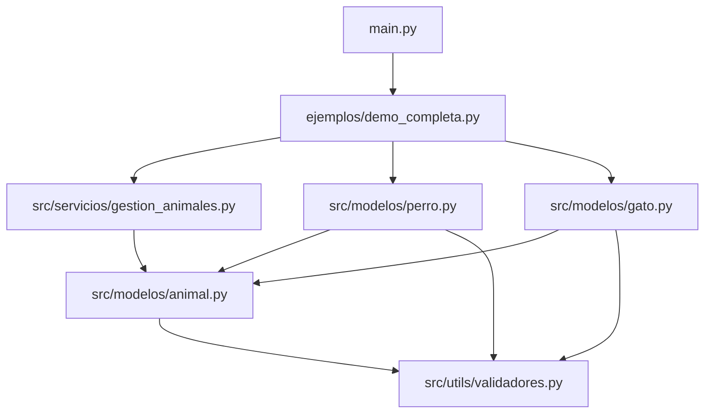
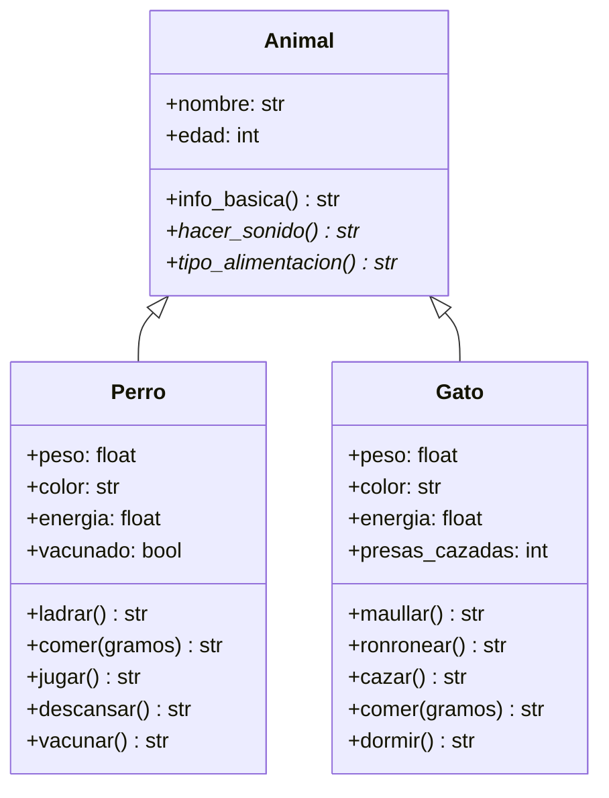

# Manual de desarrollador

Guía para entender, ejecutar y extender el proyecto. El lector que solo quiere ver la demo puede quedarse en el [README](../README.md). Los escenarios funcionales están en [Casos de uso](casos_de_uso.md).

Repositorio: [https://github.com/gracobjo/poo_animales](https://github.com/gracobjo/poo_animales)

## 1. Requisitos

- Python 3.8 o superior.
- Biblioteca estándar. No hay dependencias que instalar.
- Sistema operativo indiferente. Los comandos de esta guía asumen que el directorio actual es la raíz del proyecto.

Comprobar la versión:

```bash
python --version
```

## 2. Puesta en marcha

```bash
git clone https://github.com/gracobjo/poo_animales.git
cd poo_animales
python main.py
python -m unittest discover -s tests -v
```

`main.py` importa `ejemplos.demo_completa` y llama a `main()`. Hay que lanzarlo desde la raíz para que Python encuentre los paquetes `src` y `ejemplos`.

Las pruebas también pueden ejecutarse archivo por archivo. Cada módulo de test añade la raíz del proyecto a `sys.path`, así que este comando funciona aunque el directorio actual sea `tests/`:

```bash
python tests/test_perro.py
python tests/test_gato.py
```

## 3. Arquitectura

El código separa tres responsabilidades:

| Paquete | Responsabilidad |
| --- | --- |
| `src/modelos` | Qué es un animal y cómo se comporta cada especie. |
| `src/servicios` | Operaciones que sirven para cualquier animal. |
| `src/utils` | Validaciones numéricas reutilizables. |

`ejemplos/` demuestra el uso. `tests/` fija el comportamiento. Ni la demo ni las pruebas contienen reglas de dominio: si una regla cambia, se cambia en `src/` y se actualiza el test que la describe.



### Modelo de clases



`Animal` hereda de `ABC`. El nombre es un atributo público. La edad se guarda en `_edad` y solo debe leerse o escribirse con la propiedad `edad`. En `Perro` y `Gato`, el doble guion bajo activa el *name mangling* de Python: fuera de la clase, `__peso` no existe.

## 4. API pública

Importar desde los submódulos, que es la forma usada por la demo y las pruebas:

```python
from src.modelos.animal import Animal
from src.modelos.gato import Gato
from src.modelos.perro import Perro
from src.servicios.gestion_animales import (
    alimentar,
    animales_mayores_de,
    emitir_sonido,
    listar_info,
    total_peso,
)
from src.utils.validadores import validar_positivo, validar_rango
```

Los `__init__.py` de `modelos`, `servicios` y `utils` reexportan esos nombres. `from src.modelos import Perro` también es válido.

### Animal

| Miembro | Contrato |
| --- | --- |
| `Animal(nombre, edad)` | Lanza `TypeError`. No instanciar. |
| `nombre` | `str` público, ya recortado. |
| `edad` | Entero de 0 a 30. El setter lanza `ValueError`. |
| `info_basica()` | `"{nombre} es un {Clase} de {edad} años."` |
| `hacer_sonido()` | Abstracto. Devuelve `str`. |
| `tipo_alimentacion()` | Abstracto. Devuelve `str`. |
| `EDAD_MINIMA`, `EDAD_MAXIMA` | `0` y `30`. |

### Perro

Constructor: `Perro(nombre, edad, peso, color, energia=100)`.

| Miembro | Contrato |
| --- | --- |
| `peso` | Número mayor que cero. Lectura y escritura. |
| `color` | Texto no vacío. Se recortan espacios. |
| `energia` | Número de 0 a 100. |
| `vacunado` | `bool` de solo lectura. |
| `hacer_sonido()` | Igual que `ladrar()`. |
| `tipo_alimentacion()` | `"omnívoro"`. |
| `ladrar()` | `"{nombre} dice: ¡Guau!"`. |
| `comer(gramos)` | `+gramos/1000` kg y `+15` de energía, tope 100. |
| `jugar()` | Resta 20. Falla si hay menos de 20. |
| `descansar()` | Suma 25, tope 100. |
| `vacunar()` | Pasa a vacunado. Falla si ya lo estaba. |

Constantes de clase: `ENERGIA_MINIMA`, `ENERGIA_MAXIMA`, `COSTO_ENERGIA_JUGAR` (20), `RECUPERACION_DESCANSO` (25), `RECUPERACION_COMIDA` (15).

### Gato

Constructor: `Gato(nombre, edad, peso, color, energia=100)`.

| Miembro | Contrato |
| --- | --- |
| `peso`, `color`, `energia` | Las mismas reglas que en `Perro`. |
| `presas_cazadas` | `int` de solo lectura. Empieza en 0. |
| `hacer_sonido()` | Igual que `maullar()`. |
| `tipo_alimentacion()` | `"carnívoro"`. |
| `maullar()` | `"{nombre} dice: ¡Miau!"`. |
| `ronronear()` | Exige energía >= 20. No la consume. |
| `cazar()` | Resta 25 y suma una presa. Si no hay energía, no suma. |
| `comer(gramos)` | `+gramos/1000` kg y `+10` de energía, tope 100. |
| `dormir()` | Suma 40, tope 100. |

Constantes: `COSTO_ENERGIA_CAZAR` (25), `RECUPERACION_DORMIR` (40), `RECUPERACION_COMIDA` (10), `ENERGIA_MINIMA_RONRONEO` (20), más los límites de energía.

### Servicios

Todas las funciones aceptan cualquier subclase de `Animal`. No comprueban el tipo con `isinstance` para decidir el sonido o la comida: llaman al método y se ejecuta la versión de la clase real.

| Función | Entrada | Salida |
| --- | --- | --- |
| `emitir_sonido(animal)` | Un animal | `str` de `hacer_sonido()` |
| `alimentar(animal, gramos)` | Animal con `comer` | `str` de `comer(gramos)` |
| `listar_info(animales)` | Secuencia | `list[str]` |
| `animales_mayores_de(animales, edad_minima)` | Secuencia y entero >= 0 | `list[Animal]` |
| `total_peso(animales)` | Secuencia | `float`. `0.0` si está vacía |

`listar_info`, `animales_mayores_de` y `total_peso` rechazan un `str`: un texto es iterable, pero sus elementos no son animales. Aceptan `list` y `tuple`.

### Validadores

`validar_positivo(valor, nombre_campo)` exige un `int` o un `float` mayor que cero y devuelve el mismo valor.

`validar_rango(valor, minimo, maximo, nombre_campo)` exige un número dentro del intervalo cerrado. Si `minimo > maximo`, también lanza `ValueError`.

Los mensajes incluyen el `nombre_campo` entre comillas simples, por ejemplo `'peso' debe ser mayor que cero.`

## 5. Errores

| Situación | Excepción |
| --- | --- |
| Dato de dominio inválido | `ValueError` |
| Instanciar `Animal` | `TypeError` |
| Escribir `vacunado` o `presas_cazadas` | `AttributeError` |
| Leer `__peso` desde fuera de la clase | `AttributeError` |

Los métodos que pueden fallar (`comer`, `jugar`, `cazar`, `ronronear`, `vacunar` y los setters) validan antes de modificar el estado. Un `ValueError` deja el objeto como estaba.

`alimentar` deja pasar el `ValueError` de `comer`. Si el objeto no tiene `comer`, lanza su propio `ValueError`.

## 6. Cómo añadir una especie

Ejemplo: incorporar un `Loro` sin romper los servicios existentes.

1. Crear `src/modelos/loro.py` con `class Loro(Animal)`.
2. Llamar a `super().__init__(nombre, edad)` antes de asignar el estado propio.
3. Implementar `hacer_sonido()` y `tipo_alimentacion()`. Sin esos dos métodos la clase sigue siendo abstracta y no se puede instanciar.
4. Si el loro come, implementar `comer(gramos)` con la misma idea que perro y gato: validar, después modificar. `alimentar()` lo encontrará por duck typing y no hará falta tocarlo.
5. Exponer el estado nuevo con `@property`. Usar `__` solo para datos que no deben leerse desde fuera. Usar `validar_positivo` o `validar_rango` en el setter.
6. Añadir el export en `src/modelos/__init__.py`.
7. Crear `tests/test_loro.py` con un `setUp` que construya un loro nuevo en cada test. Cubrir el sonido, un comportamiento propio, un setter válido y un setter que deba fallar sin cambiar el valor anterior.
8. Añadir un loro a la lista de `ejemplos/demo_completa.py` y comprobar que `emitir_sonido`, `listar_info` y `total_peso` lo aceptan.
9. Documentar las reglas nuevas en el README y, si cambia lo que el cuidador puede hacer, en `docs/casos_de_uso.md`.

No hace falta modificar `Animal` para una especie nueva, salvo que el dato sea común a todos los animales.

## 7. Pruebas

Hay 56 pruebas con `unittest`. Cada método de test comprueba una sola situación. `setUp` crea el animal, así que las pruebas no comparten estado.

Al cambiar una constante de energía, los tests de perro y gato leen `Perro.COSTO_ENERGIA_JUGAR`, `Gato.RECUPERACION_COMIDA` y el resto de constantes. No hace falta reescribir el número esperado si solo cambia la constante y el test expresa el resultado a partir de ella.

Convención para un test nuevo:

```python
def test_jugar_sin_energia_no_cambia_el_estado(self) -> None:
    cansado = Perro("Tobi", 2, 8.0, "blanco", energia=10)
    with self.assertRaises(ValueError):
        cansado.jugar()
    self.assertEqual(cansado.energia, 10)
```

El nombre dice la acción y el resultado. Si el método puede fallar, el test comprueba también que el objeto no quedó a medias.

## 8. Convenciones

- Python 3.8: las anotaciones usan `List` y `Sequence` de `typing`, no `list[Animal]`, porque esa forma falla al evaluarse en 3.8.
- Docstrings en las clases y en los métodos públicos, en español, con `Args`, `Returns` y `Raises` cuando aportan algo.
- Identificadores en español y sin tilde: `energia`, `edad`. Los textos que ve el usuario sí llevan tilde.
- Líneas de hasta 79 caracteres.
- Dos líneas en blanco entre elementos de nivel de módulo. Una entre métodos.
- Los comentarios explican una decisión (por qué el setter valida, por qué `__peso` no se ve desde fuera), no repiten el nombre del método.
- No capturar un `ValueError` para volver a lanzarlo sin añadir información. En la demo sí se captura, porque el objetivo es mostrar el mensaje y seguir.

## 9. Recorrido de una llamada polimórfica

Cuando la demo ejecuta `emitir_sonido(animal)` dentro de un bucle con un perro y un gato:

1. `emitir_sonido` recibe el objeto anotado como `Animal`.
2. Llama a `animal.hacer_sonido()`.
3. Python busca el método en la clase real. En un `Perro` entra en `Perro.hacer_sonido`, que delega en `ladrar`. En un `Gato`, delega en `maullar`.
4. La función de servicio devuelve ese texto. No tiene ramas `if isinstance(animal, Perro)`.

`alimentar` sigue el mismo esquema con `comer`. La diferencia de energía (+15 o +10) vive en la subclase, no en el servicio.

## 10. Dónde cambiar cada cosa

| Si quieres… | Archivo |
| --- | --- |
| Cambiar el rango de edad | `src/modelos/animal.py` (`EDAD_MINIMA`, `EDAD_MAXIMA`) |
| Cambiar el coste de jugar, cazar, dormir o comer | Constantes de `perro.py` o `gato.py` |
| Cambiar el mensaje de un número inválido | `src/utils/validadores.py` |
| Añadir una operación de grupo | `src/servicios/gestion_animales.py` |
| Enseñar el proyecto | `ejemplos/demo_completa.py` y `main.py` |
| Describir una acción del cuidador | `docs/casos_de_uso.md` |
